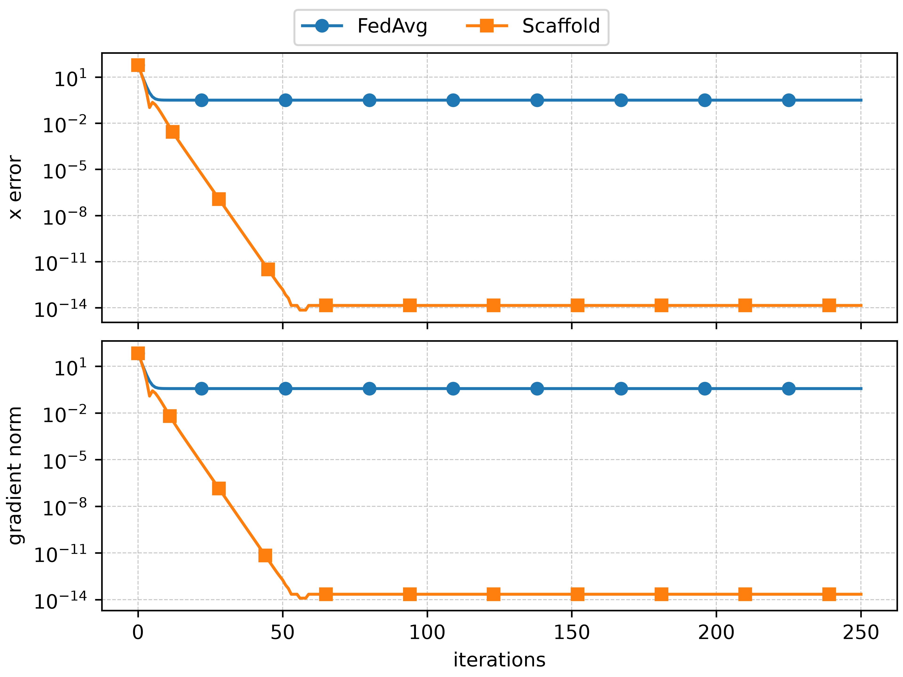
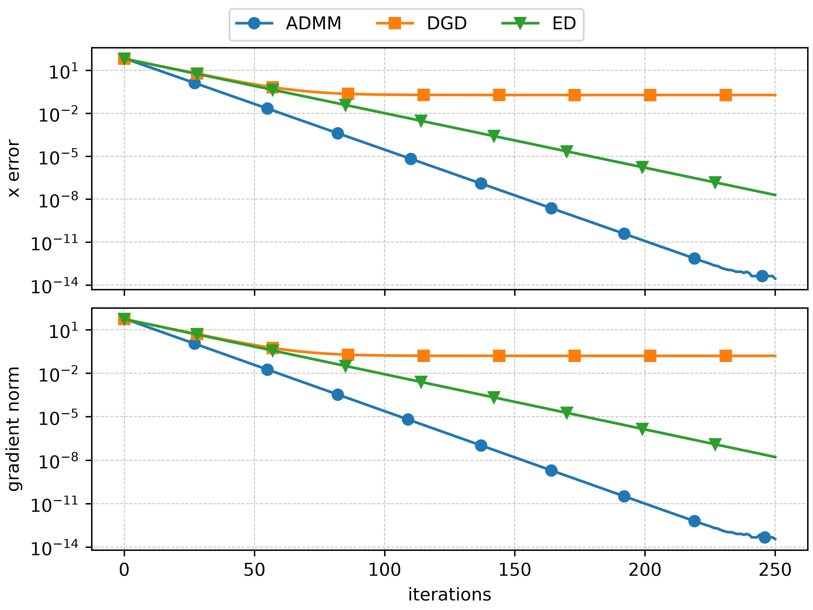

Benchmarking
============

This page covers the standard benchmark workflow and the most important settings. :doc:`customizing <customizing>`
shows how to customize each component of the benchmark (from problem to algorithms to results).

Running a benchmark
-------------------
A typical benchmark run is characterized by four steps:

1. **Benchmark problem definition**: where the local costs :math:`f_i` (see :eq:`decentralized-problem`) and the network architecture are defined. This includes defining practical constraints such as limited communications/computational power. The benchmark problem is defined as a :class:`~decent_bench.benchmark.BenchmarkProblem` object.
2. **Benchmark**: where a set of algorithms is tested on the benchmark problem; see :func:`~decent_bench.benchmark.benchmark`. The results are contained in a :class:`~decent_bench.benchmark.BenchmarkResult` object.
3. **Compute metrics**: where selected performance metrics are computed based on the benchmark results; see :func:`~decent_bench.benchmark.compute_metrics`. The computed metrics are contained in a :class:`~decent_bench.benchmark.MetricResult` object.
4. **Display metrics**: where the metrics computed in step 3. are displayed as both tables and figures; see :func:`~decent_bench.benchmark.display_metrics`.

The worflow is depicted in the diagram below:

.. mermaid::

   flowchart TB
       START(( )):::empty -->|BenchmarkProblem| A[benchmark]
       A -->|BenchmarkResult| B[compute_metrics]
       B -->|MetricResult| C[display_metrics]

       classDef empty width:0px,height:0px,fill:transparent,stroke:transparent,color:transparent;

The following code examples show how to execute this workflow in practice. The first example is for a federated
setting, the second for a peer-to-peer setting, and after each example we show the corresponding output.

Federated example
^^^^^^^^^^^^^^^^^

.. literalinclude:: ../../examples/basic_fed_example.py
    :language: python
    :linenos:

With table results:

.. code-block:: text

    algorithm                   FedAvg             Scaffold                                                                                                                                                                                                                                    
    metric                                                                                                                                                                                                                                                                                     
    gradient norm  3.71e-01 ± 0.00e+00  2.20e-14 ± 0.00e+00                                                                                                                                                                                                                                    
    x error        3.16e-01 ± 0.00e+00  1.42e-14 ± 0.00e+00  

and plots:

Peer-to-peer example
^^^^^^^^^^^^^^^^^^^^

.. literalinclude:: ../../examples/basic_p2p_example.py
    :language: python
    :linenos:

With table results:

.. code-block:: text

    algorithm                     ADMM                  DGD                   ED                                                                                                                                                                                                               
    metric                                                                                                                                                                                                                                                                                     
    gradient norm  3.62e-14 ± 0.00e+00  1.60e-01 ± 0.00e+00  1.65e-08 ± 0.00e+00                                                                                                                                                                                                               
    x error        2.84e-14 ± 0.00e+00  1.90e-01 ± 0.00e+00  1.97e-08 ± 0.00e+00 

and plots:

Explanation
^^^^^^^^^^^
In both examples, we generate a linear regression problem

.. literalinclude:: ../../examples/basic_p2p_example.py
    :language: python
    :lines: 15

characterized by the local costs
:math:`f_i(x_i) = \frac{1}{m_i} \sum_{h = 1}^{m_i} \frac{1}{2} (a_i^h x_i - b_i^h)^2` with feature vectors
:math:`a_i^h \in \mathbb{R}^{1 \times n}` and targets :math:`b_i^h \in \mathbb{R}`. Since the costs are quadratic, the
``create_regression_problem`` utility also computes the optimal solution ``x_optimal``.

We then create the federated or peer-to-peer network of agents to solve the problem, respectively:

.. literalinclude:: ../../examples/basic_fed_example.py
    :language: python
    :lines: 14

.. literalinclude:: ../../examples/basic_p2p_example.py
    :language: python
    :lines: 17-18

where each agent is assigned one of the cost functions :math:`f_i` contained in ``costs``.

These steps set up the benchmark problem, which is represented by the data structure:

.. literalinclude:: ../../examples/basic_fed_example.py
    :language: python
    :lines: 15

The next steps are the execution of the benchmark using the :func:`~decent_bench.benchmark.benchmark` function, passing
a list of the algorithms to be tested as ``algorithms``, each with its hyperparameters. The results are contained in the
:class:`~decent_bench.benchmark.BenchmarkResult` object (``results`` in the examples), which can be used to compute the
performance metrics.

In the examples, two performance metrics are selected (which are instances of :class:`~decent_bench.metrics.Metric`):

.. literalinclude:: ../../examples/basic_fed_example.py
    :language: python
    :lines: 32

with :class:`~decent_bench.metrics.metric_library.XError` being the distance from the optimal solution, and
:class:`~decent_bench.metrics.metric_library.GradientNorm` the norm of the gradient of :math:`\sum_{i = 1}^N f_i`. If
the ``table_metrics`` and ``plot_metrics`` arguments of :func:`~decent_bench.benchmark.compute_metrics` are not specified,
all the available metrics are used instead. Not all metrics are always available: for example
:class:`~decent_bench.metrics.metric_library.XError` is not available if ``x_optimal`` is not available.

Note:
    In these example scripts, execution is guarded with ``if __name__ == "__main__":`` to avoid potential issues with
    multi-threading and some of the dependencies. Errors and unexpected results might appear if this guard is not used.

The following section explains in more detail how to customize the benchmark workflow.

Customizing benchmark settings
------------------------------

Storing results
^^^^^^^^^^^^^^^
A first important tool for benchmarking is the :class:`~decent_bench.utils.checkpoint_manager.CheckpointManager`, which
is instantiated in a folder location (folder ``results`` in the example below).

.. literalinclude:: ../../examples/checkpointing_fed_example.py
    :language: python
    :linenos:

The role of the :class:`~decent_bench.utils.checkpoint_manager.CheckpointManager` is to store the results at every step
of the benchmarking workflow. This is done by passing the  :class:`~decent_bench.utils.checkpoint_manager.CheckpointManager`
instance as the ``checkpoint_manager`` argument of :func:`~decent_bench.benchmark.benchmark`, :func:`~decent_bench.benchmark.compute_metrics`, :func:`~decent_bench.benchmark.display_metrics`.
Additionally, the :class:`~decent_bench.utils.checkpoint_manager.CheckpointManager` stores snapshots of the simulation
results ("checkpoints") as the benchmark runs. This allows resuming simulations later (*e.g.* adding more iterations)
or recovering interrupted simulations.

See more in :ref:`this section <checkpointing>`.

Benchmark settings
^^^^^^^^^^^^^^^^^^
The arguments of :func:`~decent_bench.benchmark.benchmark` allow customization of the benchmark run; the most important
arguments are:

* ``algorithms``: defines which algorithms should be tested. Each algorithm is an :class:`~decent_bench.algorithms.Algorithm` object initialized with the number of iterations to run (``iterations``) and required hyperparameters.
* ``benchmark_problem``: instance of :class:`~decent_bench.benchmark.BenchmarkProblem` which defines the problem.
* ``n_trials``: if the benchmark setup (network and/or algorithms) have stochastic features, running several trials is necessary. This is possible by setting the ``n_trials`` argument. See more in :ref:`this section <reproducibility>`.
* ``max_processes``: allows to set the number of threads that should be used to run the simulations.
* ``runtime_metrics``: if the benchmark run is very long, it can be useful to monitor its progress (beyond the progress bar that is displayed by default). This can be done by plotting :class:`~decent_bench.metrics.RuntimeMetric`, which they are simple and computationally cheap performance metric displayed in a plot that evolves as the simulations run. The available runtime metrics are: :tagged:`runtime metric`.

Metrics computation and display
^^^^^^^^^^^^^^^^^^^^^^^^^^^^^^^
As discussed above, the metrics are first computed with :func:`~decent_bench.benchmark.compute_metrics`, and then
displyed with :func:`~decent_bench.benchmark.display_metrics`.

.. literalinclude:: ../../examples/basic_p2p_example.py
    :language: python
    :lines: 36-44

These steps can be customized in several ways. For :func:`~decent_bench.benchmark.compute_metrics`:

* ``table_metrics`` and ``plot_metrics``: these can be different, since some metrics cannot be plotted (*e.g.* :class:`~decent_bench.metrics.metric_library.GradientCalls`, which counts the number of total gradient calls at the end of the simulation). Passing ``None`` to both arguments will use all the available metrics (already divided by table and plot metrics); see :mod:`~decent_bench.metrics.metric_library` for the list of available metrics. These arguments can also be an empty list to avoid computing either table or plot metrics.
* ``statistics_across_agents``: as discussed later in :ref:`this section <reproducibility>`, the benchmark can run several trials and average over the results. Additionally, several metrics yield one value for each agent (this is the case of :class:`~decent_bench.metrics.metric_library.GradientCalls`), and aggregation over the per-agent metrics is required. This can be controlled via the ``statistics_across_agents`` argument, which accepts a list of statistics to be computed across agents (options are: "mean", "std", "max", "min", "median"; "mean", "std" are used by default).
* Output: the function returns a :class:`~decent_bench.benchmark.MetricResult` object, which contains four ``pandas.DataFrame``s with the computed metrics (the raw data and the aggregated data across trials and agents). The results can thus be easily inspected.

For :func:`~decent_bench.benchmark.display_metrics`:

* ``table_metrics``, ``plot_metrics``, ``algorithms``: these can be used to select only a subset of the metrics/algorithms computed by :func:`~decent_bench.benchmark.compute_metrics` and stored in the :class:`~decent_bench.benchmark.MetricResult` object.
* Table formatting: ``table_fmt`` to choose either plain text or LaTeX tables (if a :class:`~decent_bench.utils.checkpoint_manager.CheckpointManager` is defined, both are stored in the results dir); * ``scale_compute`` to scale metrics related to the computational cost like :class:`~decent_bench.metrics.metric_library.GradientCalls`, which might be significantly large.
* Plot customization 1: ``plot_grid``; ``individual_plots`` to plot each metric in a separate figure; ``plot_format``.
* Plot customization 2: by default, metrics are plotted against iteration numbers; however, this might give a biased perspective since different algorithms will have different computational costs. The plots therefore can be customized to account for this by passing a :class:`~decent_bench.metrics.ComputationalCost` object into ``computational_cost``, which defines the cost of each operation (function, gradient, hessian, proximal evaluation, and communication). The computational cost will then replace the iteration numbers on the x-axis, or both can be plotted side-by-side using ``compare_iterations_and_computational_cost``. Finally, using computational cost for the x-axis might result in large values, and ``scale_x_axis`` can be used to make them more manageable.

The following example, with corresponding output, shows the above customization options in use.

.. literalinclude:: ../../examples/display_metrics_customization.py
    :language: python
    :linenos:

1) display with default options
"""""""""""""""""""""""""""""""
Plots:

.. list-table::
   :widths: 1 1

   * - .. figure:: ../_static/display_metrics_customization-1-2.png
          :align: center

     - .. figure:: ../_static/display_metrics_customization-1-1.png
          :align: center

Table:

.. code-block:: text

    algorithm                                         FedAvg              Scaffold                                                                                                                                                                                                             
    metric                    statistic                                                                                                                                                                                                                                                        
    client drift from server  mean       1.29e+01 ± 0.00e+00   0.00e+00 ± 0.00e+00                                                                                                                                                                                                             
                              std        7.07e+00 ± 0.00e+00   0.00e+00 ± 0.00e+00                                                                                                                                                                                                             
    consensus error           mean       1.29e+01 ± 0.00e+00   1.42e-14 ± 0.00e+00                                                                                                                                                                                                             
                              std        7.07e+00 ± 0.00e+00   0.00e+00 ± 0.00e+00                                                                                                                                                                                                             
    fraction selected clients                100.00% ± 0.00%       100.00% ± 0.00%                                                                                                                                                                                                             
    gradient norm                        5.96e-01 ± 0.00e+00   4.76e-14 ± 0.00e+00                                                                                                                                                                                                             
    loss                      mean       4.62e+01 ± 0.00e+00   2.73e+02 ± 0.00e+00                                                                                                                                                                                                             
                              std        4.80e+01 ± 0.00e+00   2.35e+02 ± 0.00e+00                                                                                                                                                                                                             
    nr Hessian calls          mean       0.00e+00 ± 0.00e+00   0.00e+00 ± 0.00e+00                                                                                                                                                                                                             
                              std        0.00e+00 ± 0.00e+00   0.00e+00 ± 0.00e+00                                                                                                                                                                                                             
    nr function calls         mean       0.00e+00 ± 0.00e+00   0.00e+00 ± 0.00e+00                                                                                                                                                                                                             
                              std        0.00e+00 ± 0.00e+00   0.00e+00 ± 0.00e+00                                                                                                                                                                                                             
    nr gradient calls         mean       2.50e+04 ± 0.00e+00   2.50e+04 ± 0.00e+00                                                                                                                                                                                                             
                              std        0.00e+00 ± 0.00e+00   0.00e+00 ± 0.00e+00                                                                                                                                                                                                             
    nr proximal calls         mean       0.00e+00 ± 0.00e+00   0.00e+00 ± 0.00e+00                                                                                                                                                                                                             
                              std        0.00e+00 ± 0.00e+00   0.00e+00 ± 0.00e+00                                                                                                                                                                                                             
    nr received messages      mean       4.55e+02 ± 0.00e+00   9.09e+02 ± 0.00e+00                                                                                                                                                                                                             
                              std        6.47e+02 ± 0.00e+00   1.29e+03 ± 0.00e+00                                                                                                                                                                                                             
    nr sent messages          mean       4.55e+02 ± 0.00e+00   9.09e+02 ± 0.00e+00                                                                                                                                                                                                             
                              std        6.47e+02 ± 0.00e+00   1.29e+03 ± 0.00e+00                                                                                                                                                                                                             
    nr sent messages dropped  mean       0.00e+00 ± 0.00e+00   0.00e+00 ± 0.00e+00                                                                                                                                                                                                             
                              std        0.00e+00 ± 0.00e+00   0.00e+00 ± 0.00e+00                                                                                                                                                                                                             
    nr x updates              mean       2.50e+02 ± 0.00e+00   2.50e+02 ± 0.00e+00                                                                                                                                                                                                             
                              std        0.00e+00 ± 0.00e+00   0.00e+00 ± 0.00e+00                                                                                                                                                                                                             
    regret                               1.74e-01 ± 0.00e+00  -1.36e-13 ± 0.00e+00                                                                                                                                                                                                             
    x error                              5.84e-01 ± 0.00e+00   5.68e-14 ± 0.00e+00 

2) display subset of plots, with iteration and computational cost side-by-side
""""""""""""""""""""""""""""""""""""""""""""""""""""""""""""""""""""""""""""""

.. image:: ../_static/display_metrics_customization-2.png
    :align: center

3) display only table in LaTeX format
"""""""""""""""""""""""""""""""""""""

.. code-block:: latex

    \begin{tabular}{llcc}                                                                                                                                                                                                                                                                      
    \toprule                                                                                                                                                                                                                                                                                   
    & algorithm & FedAvg & Scaffold \\                                                                                                                                                                                                                                                        
    metric & statistic &  &  \\                                                                                                                                                                                                                                                                
    \midrule                                                                                                                                                                                                                                                                                   
    \multirow[t]{2}{*}{client drift from server} & mean & 1.77e+01 ± 0.00e+00 & 0.00e+00 ± 0.00e+00 \\                                                                                                                                                                                         
    & std & 1.20e+01 ± 0.00e+00 & 0.00e+00 ± 0.00e+00 \\                                                                                                                                                                                                                                      
    \cline{1-4}                                                                                                                                                                                                                                                                                
    \multirow[t]{2}{*}{consensus error} & mean & 1.77e+01 ± 0.00e+00 & 0.00e+00 ± 0.00e+00 \\                                                                                                                                                                                                  
    & std & 1.20e+01 ± 0.00e+00 & 0.00e+00 ± 0.00e+00 \\                                                                                                                                                                                                                                      
    \cline{1-4}                                                                                                                                                                                                                                                                                
    fraction selected clients &  & 100.00% ± 0.00% & 100.00% ± 0.00% \\                                                                                                                                                                                                                        
    \cline{1-4}                                                                                                                                                                                                                                                                                
    gradient norm &  & 3.22e-01 ± 0.00e+00 & 1.42e-15 ± 0.00e+00 \\                                                                                                                                                                                                                            
    \cline{1-4}                                                                                                                                                                                                                                                                                
    \multirow[t]{2}{*}{loss} & mean & 4.10e+01 ± 0.00e+00 & 5.41e+02 ± 0.00e+00 \\                                                                                                                                                                                                             
    & std & 4.76e+01 ± 0.00e+00 & 5.25e+02 ± 0.00e+00 \\                                                                                                                                                                                                                                      
    \cline{1-4}                                                                                                                                                                                                                                                                                
    \multirow[t]{2}{*}{nr Hessian calls} & mean & 0.00e+00 ± 0.00e+00 & 0.00e+00 ± 0.00e+00 \\                                                                                                                                                                                                 
    & std & 0.00e+00 ± 0.00e+00 & 0.00e+00 ± 0.00e+00 \\                                                                                                                                                                                                                                      
    \cline{1-4}                                                                                                                                                                                                                                                                                
    \multirow[t]{2}{*}{nr function calls} & mean & 0.00e+00 ± 0.00e+00 & 0.00e+00 ± 0.00e+00 \\                                                                                                                                                                                                
    & std & 0.00e+00 ± 0.00e+00 & 0.00e+00 ± 0.00e+00 \\                                                                                                                                                                                                                                      
    \cline{1-4}                                                                                                                                                                                                                                                                                
    \multirow[t]{2}{*}{nr gradient calls} & mean & 2.50e+04 ± 0.00e+00 & 2.50e+04 ± 0.00e+00 \\                                                                                                                                                                                                
    & std & 0.00e+00 ± 0.00e+00 & 0.00e+00 ± 0.00e+00 \\                                                                                                                                                                                                                                      
    \cline{1-4}                                                                                                                                                                                                                                                                                
    \multirow[t]{2}{*}{nr proximal calls} & mean & 0.00e+00 ± 0.00e+00 & 0.00e+00 ± 0.00e+00 \\                                                                                                                                                                                                
    & std & 0.00e+00 ± 0.00e+00 & 0.00e+00 ± 0.00e+00 \\                                                                                                                                                                                                                                      
    \cline{1-4}                                                                                                                                                                                                                                                                                
    \multirow[t]{2}{*}{nr received messages} & mean & 4.55e+02 ± 0.00e+00 & 9.09e+02 ± 0.00e+00 \\                                                                                                                                                                                             
    & std & 6.47e+02 ± 0.00e+00 & 1.29e+03 ± 0.00e+00 \\                                                                                                                                                                                                                                      
    \cline{1-4}                                                                                                                                                                                                                                                                                
    \multirow[t]{2}{*}{nr sent messages} & mean & 4.55e+02 ± 0.00e+00 & 9.09e+02 ± 0.00e+00 \\                                                                                                                                                                                                 
    & std & 6.47e+02 ± 0.00e+00 & 1.29e+03 ± 0.00e+00 \\                                                                                                                                                                                                                                      
    \cline{1-4}                                                                                                                                                                                                                                                                                
    \multirow[t]{2}{*}{nr sent messages dropped} & mean & 0.00e+00 ± 0.00e+00 & 0.00e+00 ± 0.00e+00 \\                                                                                                                                                                                         
    & std & 0.00e+00 ± 0.00e+00 & 0.00e+00 ± 0.00e+00 \\                                                                                                                                                                                                                                      
    \cline{1-4}                                                                                                                                                                                                                                                                                
    \multirow[t]{2}{*}{nr x updates} & mean & 2.50e+02 ± 0.00e+00 & 2.50e+02 ± 0.00e+00 \\                                                                                                                                                                                                     
    & std & 0.00e+00 ± 0.00e+00 & 0.00e+00 ± 0.00e+00 \\                                                                                                                                                                                                                                      
    \cline{1-4}                                                                                                                                                                                                                                                                                
    regret &  & 4.15e-02 ± 0.00e+00 & 0.00e+00 ± 0.00e+00 \\                                                                                                                                                                                                                                   
    \cline{1-4}                                                                                                                                                                                                                                                                                
    x error &  & 2.58e-01 ± 0.00e+00 & 0.00e+00 ± 0.00e+00 \\                                                                                                                                                                                                                                  
    \cline{1-4}                                                                                                                                                                                                                                                                                
    \bottomrule                                                                                                                                                                                                                                                                                
    \end{tabular}

Interpreting logger messages
^^^^^^^^^^^^^^^^^^^^^^^^^^^^
Throughout the benchmark workflow, logger messages are displayed in the terminal. The amount of information can be
tuned by setting the ``log_level`` argument of :func:`~decent_bench.benchmark.benchmark`, :func:`~decent_bench.benchmark.compute_metrics`, :func:`~decent_bench.benchmark.display_metrics`.
Examples are (printing progressively less information): ``logging.DEBUG``, ``logging.INFO`` (the default), ``logging.WARNING``, ``logging.ERROR``, ``logging.CRITICAL``.
See `here <https://docs.python.org/3/library/logging.html#logging-levels>`_ for more details.

The following are examples of the logger messages printed when running the code shown in the previous section with
the default ``log_level = logging.INFO``.

During benchmark problem creation:

.. code-block:: text

    INFO     Creating cost functions ...
    INFO     ... done!
    INFO     Finding the optimal solution to the problem ...
    INFO     ... done!                                              << with a progress bar if x_optimal is computed iteratively rather than in closed form
    INFO     Initialized checkpoint directory at 'results'          << if checkpoint_manager is defined

During benchmark run:

.. code-block:: text

    INFO     Starting benchmark execution
    Algorithm Progress Bar                                  Time   
    FedAvg    ━━━━━━━━━━━━━━━━━━━━━━━━━━━━━━━━━━━━━━━━ 100% 0:00:00
    Scaffold  ━━━━━━━━━━━━━━━━━━━━━━━━━━━━━━━━━━━━━━━━ 100% 0:00:00
    INFO     Benchmark execution complete

During metrics computation:

.. code-block:: text
    
    INFO     Starting metrics computation
    WARNING  Skipping table metric 'mse' because it is unavailable: requires problem.test_data
    ...                                                                                             << plus warnings for all other unavailable metrics
    Computing plot metrics   ━━━━━━━━━━━━━━━━━━━━━━━━━━━━━━━━━━━━━━━━ 100% 0:00:00 Plot computation complete
    Computing table metrics  ━━━━━━━━━━━━━━━━━━━━━━━━━━━━━━━━━━━━━━━━ 100% 0:00:00 Table computation complete
    INFO     Saved computed metrics result to results/metric_computation.pkl.zst                    << if checkpoint_manager is defined

During metrics display:

.. code-block:: text

    INFO     Displaying metrics
    WARNING  No available plot metrics were selected, skipping plots            << if plot_metrics = []
    INFO                                                                        << displayed table
    INFO     Compute counters (FunctionCalls, GradientCalls, HessianCalls, ProximalCalls) can yield very large numbers. Set ``scale_compute < 1`` to scale their values for display.
    WARNING  Metric 'consensus error' has y_log=True but contains non-positive y values. They were replaced with 1e-15 for plotting purposes. Non-positive values that were replaced (when close to 0, they are likely rounding errors): [0.0].
    INFO     Infinite/NaN values likely indicate algorithm divergence. Inspect plots to confirm.
    INFO     Saved LaTeX table to results/results/table.tex
    INFO     Saved text table to results/results/table.txt

where:

* The warning about 'consensus error' indicates that this metric should be plotted with a logarithmic y-axis, but it has a zero/negative value (in this case, zero); for plotting only, these values are replaced by :math:`10^{-15}` or a similarly small value.
* If any of the algorithms diverges (*e.g.* the selected step-size is too large), then inf or nan values will be displayed in the table. For the plots, the sequences of metrics values are truncated at the first occurrence of inf/nan.

Customizing benchmark scenario
------------------------------

.. _reproducibility:
Reproducibility
---------------
Many decentralized algorithms and network scenarios have stochstic features.

For reproducible experiments, set seeds consistently for all random sources you use.

- Python random module
- NumPy
- framework-specific RNGs (for example PyTorch)
- graph generation utilities that accept ``seed``

.. code-block:: python
    import random
    import numpy as np
    import networkx as nx
    random.seed(0)
    np.random.seed(0)
    graph = nx.random_regular_graph(d=3, n=100, seed=0)

If your benchmark uses framework-level randomness, also set that framework's seed at startup.
Use a fixed seed per experiment when comparing algorithms, and change the seed between experiment batches when you
want robustness checks.

Available algorithms
--------------------

Note: algorithms are slightly modified with respect to the corresponding papers to ensure that they work in a broader
range of conditions (asynchorny/partial participation, loss of communications, etc) than the original papers.

Peer-to-peer
~~~~~~~~~~~~
P2P algorithms: :tagged:`peer-to-peer`

ADMM+P2P: :tagged:`peer-to-peer, ADMM`

metrics: :tagged:`metric`
runtime metrics: :tagged:`runtime metric`

Federated
~~~~~~~~~

federated algorithms: :tagged:`federated`

.. _checkpointing:
Storing results and checkpointing
----------------------------------
By default, benchmark progress and results (plots and tables) are only displayed but not saved to disk. To save results and enable
resumption of interrupted benchmarks, use the checkpoint functionality.

Basic checkpointing
~~~~~~~~~~~~~~~~~~~
Enable checkpointing by providing a :class:`~decent_bench.utils.checkpoint_manager.CheckpointManager` instance. This automatically saves:

1. Progress checkpoints allowing benchmark resumption if interrupted
2. Metric computation results to ``{checkpoint_dir}/metric_computation.pkl``
3. Plots to ``{checkpoint_dir}/results/plots_figX.png``
4. Tables to ``{checkpoint_dir}/results/table.txt`` and ``{checkpoint_dir}/results/table.tex``

where 3. and 4. are true if ``save_path`` is set to the checkpoint manager's results path in :func:`~decent_bench.benchmark.display_metrics`.

.. code-block:: python

    from decent_bench import benchmark
    from decent_bench.costs import LinearRegressionCost
    from decent_bench.distributed_algorithms import ADMM, DGD
    from decent_bench.metrics.runtime_library import RuntimeLoss, RuntimeRegret
    from decent_bench.utils.checkpoint_manager import CheckpointManager

    if __name__ == "__main__":
        checkpoint_manager = CheckpointManager(checkpoint_dir="benchmark_results/my_experiment")

        # Saves step 1.
        benchmark_result = benchmark.benchmark(
            algorithms=[
                DGD(iterations=10000, step_size=0.001),
                ADMM(iterations=10000, penalty=10, relaxation=0.3),
            ],
            benchmark_problem=benchmark.create_regression_problem(LinearRegressionCost),
            checkpoint_manager=checkpoint_manager,
            runtime_metrics=[
                RuntimeLoss(update_interval=100, save_path=checkpoint_manager.get_results_path()),
                RuntimeRegret(update_interval=100, save_path=checkpoint_manager.get_results_path()),
            ],
        )

        # Saves step 2.
        metrics_result = benchmark.compute_metrics(benchmark_result, checkpoint_manager)

        # Save step 3. and 4. if save_path is set to checkpoint_manager.get_results_path(), can be any other path as well.
        benchmark.display_metrics(
            metrics_result,
            save_path=checkpoint_manager.get_results_path(),
        )

The checkpoint directory structure:

.. code-block:: text

    benchmark_results/my_experiment/
    ├── metadata.json                   # Run configuration and algorithm metadata
    ├── benchmark_problem.pkl           # Initial benchmark problem state (before any trials)
    ├── initial_algorithms.pkl          # Initial algorithm states (before any trials)
    ├── metric_computation.pkl          # Computed metrics results (after all trials complete)
    ├── algorithm_0/                    # Directory for first algorithm
    │   ├── trial_0/                    # Directory for trial 0
    │   │   ├── checkpoint_0000100.pkl  # Combined algorithm+network state at iteration 100
    │   │   ├── checkpoint_0000200.pkl  # Combined algorithm+network state at iteration 200
    │   │   ├── progress.json           # {"last_completed_iteration": N}
    │   │   └── complete.json           # Marker file, contains path to final checkpoint
    │   ├── trial_1/
    │   │   └── ...
    │   └── trial_N/
    │       └── ...
    └── results/                        # Results directory for storing final tables and plots after completion
        ├── plots_fig1.png              # Final plot for figure 1 with plot results
        ├── plots_fig2.png              # Final plot for figure 2 with plot results
        ├── table.tex                   # Final LaTeX file with table results
        └── table.txt                   # Final text file with table results

Checkpoint parameters
~~~~~~~~~~~~~~~~~~~~~
Control checkpoint behavior with these parameters:

- **checkpoint_dir**: Directory path to save checkpoints. Must be empty or non-existent when starting a new benchmark.
- **checkpoint_step**: Number of iterations between checkpoints within each trial. If ``None``, only saves at trial completion. For long-running algorithms, use a value like 1000 to checkpoint during execution.
- **keep_n_checkpoints**: Maximum number of iteration checkpoints to keep per trial. Older checkpoints are automatically deleted to save disk space. Default is 3.
- **benchmark_metadata**: Optional dictionary to store custom metadata about the benchmark run (e.g., descriptions, system info, notes). This is saved in ``metadata.json`` and can be used for tracking and analysis.

.. code-block:: python

    import platform

    from decent_bench import benchmark
    from decent_bench.costs import LinearRegressionCost
    from decent_bench.distributed_algorithms import DGD
    from decent_bench.utils.checkpoint_manager import CheckpointManager

    if __name__ == "__main__":
        benchmark.benchmark(
            algorithms=[DGD(iterations=50000, step_size=0.001)],
            benchmark_problem=benchmark.create_regression_problem(LinearRegressionCost),
            checkpoint_manager=CheckpointManager(
                checkpoint_dir="benchmark_results/long_run",
                checkpoint_step=5000,      # Checkpoint every 5000 iterations
                keep_n_checkpoints=5,      # Keep 5 most recent checkpoints
                benchmark_metadata={
                    "description": "Testing DGD step size sensitivity",
                    "system": platform.system(),
                    "python_version": platform.python_version(),
                    "notes": "Baseline run for paper experiments",
                },
            ),
        )

Resuming benchmarks
~~~~~~~~~~~~~~~~~~~
If a benchmark is interrupted, resume from the most recent checkpoint:

.. code-block:: python

    from decent_bench import benchmark
    from decent_bench.utils.checkpoint_manager import CheckpointManager

    if __name__ == "__main__":
        benchmark_result = benchmark.resume_benchmark(
            checkpoint_dir=CheckpointManager(checkpoint_dir="benchmark_results/my_experiment"),
            create_backup=True,  # Creates a backup zip before resuming
        )

Extend an existing benchmark with more iterations or trials:

.. code-block:: python

    from decent_bench import benchmark
    from decent_bench.utils.checkpoint_manager import CheckpointManager

    if __name__ == "__main__":
        benchmark_result = benchmark.resume_benchmark(
            checkpoint_dir=CheckpointManager(checkpoint_dir="benchmark_results/my_experiment"),
            increase_iterations=5000,  # Run 5000 additional iterations
            increase_trials=10,        # Run 10 additional trials
            create_backup=True,
        )

The optional parameters ``checkpoint_step`` and ``keep_n_checkpoints`` in :class:`~decent_bench.utils.checkpoint_manager.CheckpointManager` 
can be changed when resuming to control how frequently checkpoints are saved and how many are kept, allowing you to manage disk space for long-running benchmarks.

Saving metric computations
~~~~~~~~~~~~~~~~~~~~~~~~~~
By default, computed metrics are not saved unless a :class:`~decent_bench.utils.checkpoint_manager.CheckpointManager` is provided.
If provided, computed metrics are saved to ``{checkpoint_dir}/metric_computation.pkl`` after all trials complete. 
This allows you to preserve the results of expensive metric computations for later analysis without needing to recompute them.
This is useful when you want to modify plot settings, table formatting or :class:`~decent_bench.metrics.ComputationalCost` values after the benchmark has completed, without needing to rerun the entire benchmark or metric computation.

.. code-block:: python

    from decent_bench import benchmark
    from decent_bench.costs import LinearRegressionCost
    from decent_bench.distributed_algorithms import DGD
    from decent_bench.utils.checkpoint_manager import CheckpointManager
    import platform

    if __name__ == "__main__":
        checkpoint_manager = CheckpointManager(checkpoint_dir="benchmark_results/my_experiment")

        benchmark_result = benchmark.benchmark(
            algorithms=[DGD(iterations=1000, step_size=0.001)],
            benchmark_problem=benchmark.create_regression_problem(LinearRegressionCost),
            checkpoint_manager=checkpoint_manager,
        )

        metrics_result = benchmark.compute_metrics(benchmark_result, checkpoint_manager)

Loading :class:`~decent_bench.benchmark._benchmark_result.BenchmarkResult` for metric computations
~~~~~~~~~~~~~~~~~~~~~~~~~~~~~~~~~~~~~~~~~~~~~~~~~~~~~~~~~~~~~~~~~~~~~~~~~~~~~~~~~~~~~~~~~~~~~~~~~~
Furthermore, the checkpoint manager can be used to load previous benchmark results by setting ``benchmark_result`` to ``None`` in :func:`~decent_bench.benchmark.compute_metrics`,
making sure that the checkpoint manager is pointing to at least a partially completed benchmark. 
This allows you to compute new metrics from previously completed benchmarks or to modify existing metrics without needing to rerun the entire benchmark.
The new metrics will be saved to the checkpoint directory as described above.

.. code-block:: python

    from decent_bench import benchmark
    from decent_bench.utils.checkpoint_manager import CheckpointManager

    if __name__ == "__main__":
        checkpoint_manager = CheckpointManager(checkpoint_dir="benchmark_results/my_experiment")

        metrics_result = benchmark.compute_metrics(
            benchmark_result=None,
            checkpoint_manager=checkpoint_manager
        )

Loading :class:`~decent_bench.benchmark.MetricResult` for displaying metrics
~~~~~~~~~~~~~~~~~~~~~~~~~~~~~~~~~~~~~~~~~~~~~~~~~~~~~~~~~~~~~~~~~~~~~~~~~~~~~~~~~~~~~~~~~~~~~
Similarly, you can load previously computed metrics by setting ``metrics_result`` to ``None`` in :func:`~decent_bench.benchmark.display_metrics` and providing the same checkpoint manager.
The loaded :class:`~decent_bench.benchmark.MetricResult` exposes ``algorithms``,
``table_metrics``, and ``plot_metrics`` to discover valid filter values.

.. code-block:: python

    from decent_bench import benchmark
    from decent_bench.utils.checkpoint_manager import CheckpointManager

    if __name__ == "__main__":
        checkpoint_manager = CheckpointManager(checkpoint_dir="benchmark_results/my_experiment")

        metrics_result = checkpoint_manager.load_metrics_result()
        if metrics_result is None:
            raise ValueError("No computed metrics found in checkpoint directory")

        print("Available algorithms:", metrics_result.algorithms)
        print("Available table metrics:", metrics_result.table_metrics)
        print("Available plot metrics:", metrics_result.plot_metrics)

        benchmark.display_metrics(
            metrics_result=metrics_result,
            checkpoint_manager=checkpoint_manager,
            algorithms=["DGD"],
            table_metrics=["nr gradient calls"],
            plot_metrics=["regret"],
            save_path=checkpoint_manager.get_results_path(),
        )
