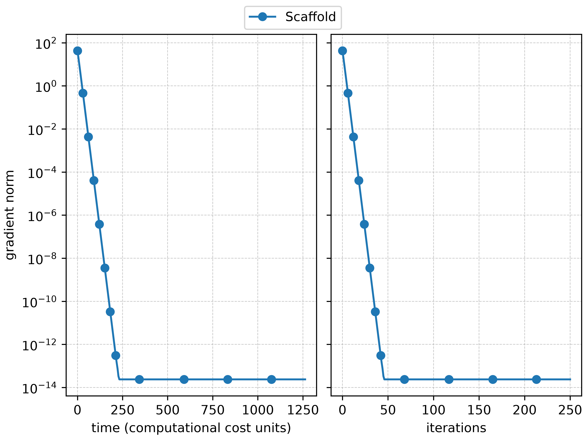

Customizing benchmark settings
------------------------------

Storing results
^^^^^^^^^^^^^^^
A first important tool for benchmarking is the :class:`~decent_bench.utils.checkpoint_manager.CheckpointManager`, which
is instantiated in a folder location (folder ``results`` in the example below).

.. literalinclude:: ../../../examples/checkpointing_fed_example.py
    :language: python
    :linenos:

The role of the :class:`~decent_bench.utils.checkpoint_manager.CheckpointManager` is to store the results at every step
of the benchmarking workflow. This is done by passing the  :class:`~decent_bench.utils.checkpoint_manager.CheckpointManager`
instance as the ``checkpoint_manager`` argument of :func:`~decent_bench.benchmark.benchmark`, :func:`~decent_bench.benchmark.compute_metrics`, :func:`~decent_bench.benchmark.display_metrics`.
Additionally, the :class:`~decent_bench.utils.checkpoint_manager.CheckpointManager` stores snapshots of the simulation
results ("checkpoints") as the benchmark runs. This allows resuming simulations later (*e.g.* adding more iterations)
or recovering interrupted simulations.

See more in :ref:`this section <checkpointing>`.

Benchmark settings
^^^^^^^^^^^^^^^^^^
The arguments of :func:`~decent_bench.benchmark.benchmark` allow customization of the benchmark run; the most important
arguments are:

* ``algorithms``: defines which algorithms should be tested. Each algorithm is an :class:`~decent_bench.algorithms.Algorithm` object initialized with the number of iterations to run (``iterations``) and required hyperparameters.
* ``benchmark_problem``: instance of :class:`~decent_bench.benchmark.BenchmarkProblem` which defines the problem.
* ``n_trials``: if the benchmark setup (network and/or algorithms) have stochastic features, running several trials is necessary. This is possible by setting the ``n_trials`` argument. See more in :ref:`this section <reproducibility>`.
* ``max_processes``: allows to set the number of threads that should be used to run the simulations.
* ``runtime_metrics``: if the benchmark run is very long, it can be useful to monitor its progress (beyond the progress bar that is displayed by default). This can be done by plotting :class:`~decent_bench.metrics.RuntimeMetric`, which they are simple and computationally cheap performance metric displayed in a plot that evolves as the simulations run. The available runtime metrics are: :tagged:`runtime metric`.

Metrics computation and display
^^^^^^^^^^^^^^^^^^^^^^^^^^^^^^^
As discussed above, the metrics are first computed with :func:`~decent_bench.benchmark.compute_metrics`, and then
displyed with :func:`~decent_bench.benchmark.display_metrics`.

.. literalinclude:: ../../../examples/basic_p2p_example.py
    :language: python
    :lines: 36-44

These steps can be customized in several ways. For :func:`~decent_bench.benchmark.compute_metrics`:

* ``table_metrics`` and ``plot_metrics``: these can be different, since some metrics cannot be plotted (*e.g.* :class:`~decent_bench.metrics.metric_library.GradientCalls`, which counts the number of total gradient calls at the end of the simulation). Passing ``None`` to both arguments will use all the available metrics (already divided by table and plot metrics); see :mod:`~decent_bench.metrics.metric_library` for the list of available metrics. These arguments can also be an empty list to avoid computing either table or plot metrics.
* ``statistics_across_agents``: as discussed later in :ref:`this section <reproducibility>`, the benchmark can run several trials and average over the results. Additionally, several metrics yield one value for each agent (this is the case of :class:`~decent_bench.metrics.metric_library.GradientCalls`), and aggregation over the per-agent metrics is required. This can be controlled via the ``statistics_across_agents`` argument, which accepts a list of statistics to be computed across agents (options are: "mean", "std", "max", "min", "median"; "mean", "std" are used by default).
* Output: the function returns a :class:`~decent_bench.benchmark.MetricResult` object, which contains four ``pandas.DataFrame`` with the computed metrics (the raw data and the aggregated data across trials and agents). The results can thus be easily inspected.

For :func:`~decent_bench.benchmark.display_metrics`:

* ``table_metrics``, ``plot_metrics``, ``algorithms``: these can be used to select only a subset of the metrics/algorithms computed by :func:`~decent_bench.benchmark.compute_metrics` and stored in the :class:`~decent_bench.benchmark.MetricResult` object.
* Table formatting: ``table_fmt`` to choose either plain text or LaTeX tables (if a :class:`~decent_bench.utils.checkpoint_manager.CheckpointManager` is defined, both are stored in the results dir); ``scale_compute`` to scale metrics related to the computational cost like :class:`~decent_bench.metrics.metric_library.GradientCalls`, which might be significantly large.
* Plot customization 1: ``plot_grid``; ``individual_plots`` to plot each metric in a separate figure; ``plot_format``.
* Plot customization 2: by default, metrics are plotted against iteration numbers; however, this might give a biased perspective since different algorithms will have different computational costs. The plots therefore can be customized to account for this by passing a :class:`~decent_bench.metrics.ComputationalCost` object into ``computational_cost``, which defines the cost of each operation (function, gradient, hessian, proximal evaluation, and communication). The computational cost will then replace the iteration numbers on the x-axis, or both can be plotted side-by-side using ``compare_iterations_and_computational_cost``. Finally, using computational cost for the x-axis might result in large values, and ``scale_x_axis`` can be used to make them more manageable.

The following example, with corresponding output, shows the above customization options in use.

.. literalinclude:: ../../../examples/display_metrics_customization.py
    :language: python
    :linenos:

1) display with default options
"""""""""""""""""""""""""""""""
Plots:

.. list-table::
   :widths: 1 1

   * - .. figure:: ../../_static/display_metrics_customization-1-2.png
          :align: center

     - .. figure:: ../../_static/display_metrics_customization-1-1.png
          :align: center

Table:

.. code-block:: text

    algorithm                                         FedAvg              Scaffold                                                                                                                                                                                                             
    metric                    statistic                                                                                                                                                                                                                                                        
    client drift from server  mean       1.29e+01 ± 0.00e+00   0.00e+00 ± 0.00e+00                                                                                                                                                                                                             
                              std        7.07e+00 ± 0.00e+00   0.00e+00 ± 0.00e+00                                                                                                                                                                                                             
    consensus error           mean       1.29e+01 ± 0.00e+00   1.42e-14 ± 0.00e+00                                                                                                                                                                                                             
                              std        7.07e+00 ± 0.00e+00   0.00e+00 ± 0.00e+00                                                                                                                                                                                                             
    fraction selected clients                100.00% ± 0.00%       100.00% ± 0.00%                                                                                                                                                                                                             
    gradient norm                        5.96e-01 ± 0.00e+00   4.76e-14 ± 0.00e+00                                                                                                                                                                                                             
    loss                      mean       4.62e+01 ± 0.00e+00   2.73e+02 ± 0.00e+00                                                                                                                                                                                                             
                              std        4.80e+01 ± 0.00e+00   2.35e+02 ± 0.00e+00                                                                                                                                                                                                             
    nr Hessian calls          mean       0.00e+00 ± 0.00e+00   0.00e+00 ± 0.00e+00                                                                                                                                                                                                             
                              std        0.00e+00 ± 0.00e+00   0.00e+00 ± 0.00e+00                                                                                                                                                                                                             
    nr function calls         mean       0.00e+00 ± 0.00e+00   0.00e+00 ± 0.00e+00                                                                                                                                                                                                             
                              std        0.00e+00 ± 0.00e+00   0.00e+00 ± 0.00e+00                                                                                                                                                                                                             
    nr gradient calls         mean       2.50e+04 ± 0.00e+00   2.50e+04 ± 0.00e+00                                                                                                                                                                                                             
                              std        0.00e+00 ± 0.00e+00   0.00e+00 ± 0.00e+00                                                                                                                                                                                                             
    nr proximal calls         mean       0.00e+00 ± 0.00e+00   0.00e+00 ± 0.00e+00                                                                                                                                                                                                             
                              std        0.00e+00 ± 0.00e+00   0.00e+00 ± 0.00e+00                                                                                                                                                                                                             
    nr received messages      mean       4.55e+02 ± 0.00e+00   9.09e+02 ± 0.00e+00                                                                                                                                                                                                             
                              std        6.47e+02 ± 0.00e+00   1.29e+03 ± 0.00e+00                                                                                                                                                                                                             
    nr sent messages          mean       4.55e+02 ± 0.00e+00   9.09e+02 ± 0.00e+00                                                                                                                                                                                                             
                              std        6.47e+02 ± 0.00e+00   1.29e+03 ± 0.00e+00                                                                                                                                                                                                             
    nr sent messages dropped  mean       0.00e+00 ± 0.00e+00   0.00e+00 ± 0.00e+00                                                                                                                                                                                                             
                              std        0.00e+00 ± 0.00e+00   0.00e+00 ± 0.00e+00                                                                                                                                                                                                             
    nr x updates              mean       2.50e+02 ± 0.00e+00   2.50e+02 ± 0.00e+00                                                                                                                                                                                                             
                              std        0.00e+00 ± 0.00e+00   0.00e+00 ± 0.00e+00                                                                                                                                                                                                             
    regret                               1.74e-01 ± 0.00e+00  -1.36e-13 ± 0.00e+00                                                                                                                                                                                                             
    x error                              5.84e-01 ± 0.00e+00   5.68e-14 ± 0.00e+00 

2) display subset of plots, with iteration and computational cost side-by-side
""""""""""""""""""""""""""""""""""""""""""""""""""""""""""""""""""""""""""""""

3) display only table in LaTeX format
"""""""""""""""""""""""""""""""""""""

.. code-block:: latex

    \begin{tabular}{llcc}                                                                                                                                                                                                                                                                      
    \toprule                                                                                                                                                                                                                                                                                   
    & algorithm & FedAvg & Scaffold \\                                                                                                                                                                                                                                                        
    metric & statistic &  &  \\                                                                                                                                                                                                                                                                
    \midrule                                                                                                                                                                                                                                                                                   
    \multirow[t]{2}{*}{client drift from server} & mean & 1.77e+01 ± 0.00e+00 & 0.00e+00 ± 0.00e+00 \\                                                                                                                                                                                         
    & std & 1.20e+01 ± 0.00e+00 & 0.00e+00 ± 0.00e+00 \\                                                                                                                                                                                                                                      
    \cline{1-4}                                                                                                                                                                                                                                                                                
    \multirow[t]{2}{*}{consensus error} & mean & 1.77e+01 ± 0.00e+00 & 0.00e+00 ± 0.00e+00 \\                                                                                                                                                                                                  
    & std & 1.20e+01 ± 0.00e+00 & 0.00e+00 ± 0.00e+00 \\                                                                                                                                                                                                                                      
    \cline{1-4}                                                                                                                                                                                                                                                                                
    fraction selected clients &  & 100.00% ± 0.00% & 100.00% ± 0.00% \\                                                                                                                                                                                                                        
    \cline{1-4}                                                                                                                                                                                                                                                                                
    gradient norm &  & 3.22e-01 ± 0.00e+00 & 1.42e-15 ± 0.00e+00 \\                                                                                                                                                                                                                            
    \cline{1-4}                                                                                                                                                                                                                                                                                
    \multirow[t]{2}{*}{loss} & mean & 4.10e+01 ± 0.00e+00 & 5.41e+02 ± 0.00e+00 \\                                                                                                                                                                                                             
    & std & 4.76e+01 ± 0.00e+00 & 5.25e+02 ± 0.00e+00 \\                                                                                                                                                                                                                                      
    \cline{1-4}                                                                                                                                                                                                                                                                                
    \multirow[t]{2}{*}{nr Hessian calls} & mean & 0.00e+00 ± 0.00e+00 & 0.00e+00 ± 0.00e+00 \\                                                                                                                                                                                                 
    & std & 0.00e+00 ± 0.00e+00 & 0.00e+00 ± 0.00e+00 \\                                                                                                                                                                                                                                      
    \cline{1-4}                                                                                                                                                                                                                                                                                
    \multirow[t]{2}{*}{nr function calls} & mean & 0.00e+00 ± 0.00e+00 & 0.00e+00 ± 0.00e+00 \\                                                                                                                                                                                                
    & std & 0.00e+00 ± 0.00e+00 & 0.00e+00 ± 0.00e+00 \\                                                                                                                                                                                                                                      
    \cline{1-4}                                                                                                                                                                                                                                                                                
    \multirow[t]{2}{*}{nr gradient calls} & mean & 2.50e+04 ± 0.00e+00 & 2.50e+04 ± 0.00e+00 \\                                                                                                                                                                                                
    & std & 0.00e+00 ± 0.00e+00 & 0.00e+00 ± 0.00e+00 \\                                                                                                                                                                                                                                      
    \cline{1-4}                                                                                                                                                                                                                                                                                
    \multirow[t]{2}{*}{nr proximal calls} & mean & 0.00e+00 ± 0.00e+00 & 0.00e+00 ± 0.00e+00 \\                                                                                                                                                                                                
    & std & 0.00e+00 ± 0.00e+00 & 0.00e+00 ± 0.00e+00 \\                                                                                                                                                                                                                                      
    \cline{1-4}                                                                                                                                                                                                                                                                                
    \multirow[t]{2}{*}{nr received messages} & mean & 4.55e+02 ± 0.00e+00 & 9.09e+02 ± 0.00e+00 \\                                                                                                                                                                                             
    & std & 6.47e+02 ± 0.00e+00 & 1.29e+03 ± 0.00e+00 \\                                                                                                                                                                                                                                      
    \cline{1-4}                                                                                                                                                                                                                                                                                
    \multirow[t]{2}{*}{nr sent messages} & mean & 4.55e+02 ± 0.00e+00 & 9.09e+02 ± 0.00e+00 \\                                                                                                                                                                                                 
    & std & 6.47e+02 ± 0.00e+00 & 1.29e+03 ± 0.00e+00 \\                                                                                                                                                                                                                                      
    \cline{1-4}                                                                                                                                                                                                                                                                                
    \multirow[t]{2}{*}{nr sent messages dropped} & mean & 0.00e+00 ± 0.00e+00 & 0.00e+00 ± 0.00e+00 \\                                                                                                                                                                                         
    & std & 0.00e+00 ± 0.00e+00 & 0.00e+00 ± 0.00e+00 \\                                                                                                                                                                                                                                      
    \cline{1-4}                                                                                                                                                                                                                                                                                
    \multirow[t]{2}{*}{nr x updates} & mean & 2.50e+02 ± 0.00e+00 & 2.50e+02 ± 0.00e+00 \\                                                                                                                                                                                                     
    & std & 0.00e+00 ± 0.00e+00 & 0.00e+00 ± 0.00e+00 \\                                                                                                                                                                                                                                      
    \cline{1-4}                                                                                                                                                                                                                                                                                
    regret &  & 4.15e-02 ± 0.00e+00 & 0.00e+00 ± 0.00e+00 \\                                                                                                                                                                                                                                   
    \cline{1-4}                                                                                                                                                                                                                                                                                
    x error &  & 2.58e-01 ± 0.00e+00 & 0.00e+00 ± 0.00e+00 \\                                                                                                                                                                                                                                  
    \cline{1-4}                                                                                                                                                                                                                                                                                
    \bottomrule                                                                                                                                                                                                                                                                                
    \end{tabular}

Interpreting logger messages
^^^^^^^^^^^^^^^^^^^^^^^^^^^^
Throughout the benchmark workflow, logger messages are displayed in the terminal. The amount of information can be
tuned by setting the ``log_level`` argument of :func:`~decent_bench.benchmark.benchmark`, :func:`~decent_bench.benchmark.compute_metrics`, :func:`~decent_bench.benchmark.display_metrics`.
Examples are (printing progressively less information): ``logging.DEBUG``, ``logging.INFO`` (the default), ``logging.WARNING``, ``logging.ERROR``, ``logging.CRITICAL``.
See `here <https://docs.python.org/3/library/logging.html#logging-levels>`_ for more details.

The following are examples of the logger messages printed when running the code shown in the previous section with
the default ``log_level = logging.INFO``.

During benchmark problem creation:

.. code-block:: text

    INFO     Creating cost functions ...
    INFO     ... done!
    INFO     Finding the optimal solution to the problem ...
    INFO     ... done!                                              # with a progress bar if x_optimal is computed iteratively rather than in closed form
    INFO     Initialized checkpoint directory at 'results'          # if checkpoint_manager is defined

During benchmark run:

.. code-block:: text

    INFO     Starting benchmark execution
    Algorithm Progress Bar                                  Time   
    FedAvg    ━━━━━━━━━━━━━━━━━━━━━━━━━━━━━━━━━━━━━━━━ 100% 0:00:00
    Scaffold  ━━━━━━━━━━━━━━━━━━━━━━━━━━━━━━━━━━━━━━━━ 100% 0:00:00
    INFO     Benchmark execution complete

During metrics computation:

.. code-block:: text
    
    INFO     Starting metrics computation
    WARNING  Skipping table metric 'mse' because it is unavailable: requires problem.test_data
    ...                                                                                             # plus warnings for all other unavailable metrics
    Computing plot metrics   ━━━━━━━━━━━━━━━━━━━━━━━━━━━━━━━━━━━━━━━━ 100% 0:00:00 Plot computation complete
    Computing table metrics  ━━━━━━━━━━━━━━━━━━━━━━━━━━━━━━━━━━━━━━━━ 100% 0:00:00 Table computation complete
    INFO     Saved computed metrics result to results/metric_computation.pkl.zst                    # if checkpoint_manager is defined

During metrics display:

.. code-block:: text

    INFO     Displaying metrics
    WARNING  No available plot metrics were selected, skipping plots            # if plot_metrics = []
    INFO                                                                        # displayed table
    INFO     Compute counters (FunctionCalls, GradientCalls, HessianCalls, ProximalCalls) can yield very large numbers. Set ``scale_compute < 1`` to scale their values for display.
    WARNING  Metric 'consensus error' has y_log=True but contains non-positive y values. They were replaced with 1e-15 for plotting purposes. Non-positive values that were replaced (when close to 0, they are likely rounding errors): [0.0].
    INFO     Infinite/NaN values likely indicate algorithm divergence. Inspect plots to confirm.
    INFO     Saved LaTeX table to results/results/table.tex
    INFO     Saved text table to results/results/table.txt

where:

* The warning about 'consensus error' indicates that this metric should be plotted with a logarithmic y-axis, but it has a zero/negative value (in this case, zero); for plotting only, these values are replaced by :math:`10^{-15}` or a similarly small value.
* If any of the algorithms diverges (*e.g.* the selected step-size is too large), then inf or nan values will be displayed in the table. For the plots, the sequences of metrics values are truncated at the first occurrence of inf/nan.
